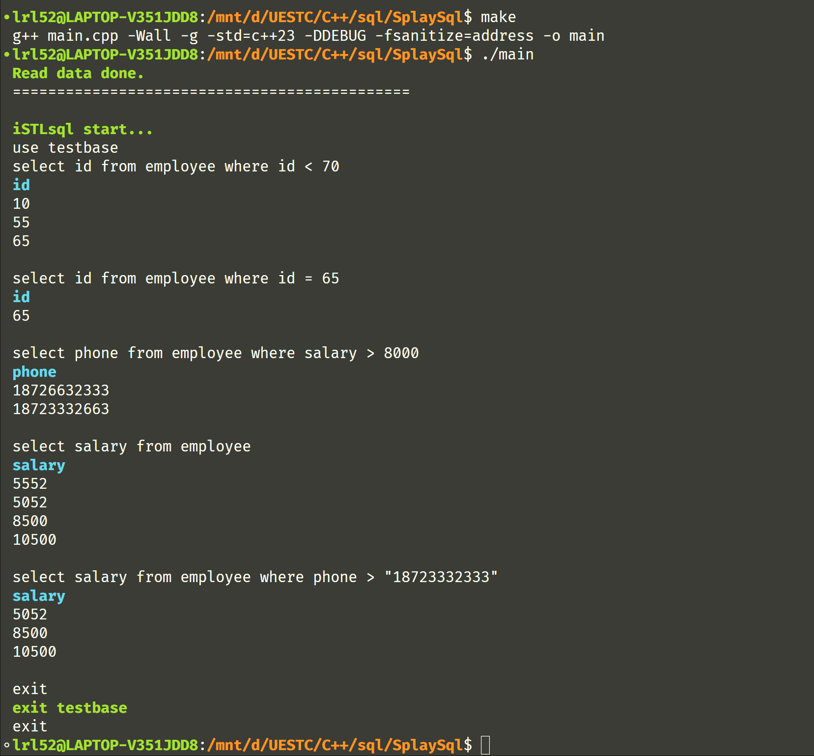

## 现代 C++ 实现简单 SQL 数据库

> iSTLsql（ i 谐音“爱”，STL 即 C++ 标准模板库）是一个简单的 SQL 数据库，基于 `std::multiset` 实现索引结构。目前支持白老师大作业要求的所有功能

### Introduction

环境：Ubuntu-22.04，g++ 11.2.0

数据暂时存储在 `./testdata.in` 中，以 SQL 语句的形式存储，可以作为示例参考，**仅支持少量 SQL 语句，语法相较实际 SQL 语句有差异，具体后面 SQL Grammar 和 Example**

#### 快速构建并启动

```sh
make
./main
```

### Used C++ Features

✅ `auto` 类型推导与函数返回值推导，基于区间的 `for`，结构化绑定，函数默认参数值

✅ C++ 强类型枚举类 `enum class`,，左值引用，`using` 定义新类型

✅ `std::string`, `std::unordered_map`, `std::multiset`

✅ `std::stringstream`, `std::vector`, `std::tuple`

✅ `lambda` 表达式（匿名函数）, `std::functional`

✅ 类模板 `template`，回调函数 （callback），重载（`operator`）二元运算符

✅ 类 `class`（构造函数，析构函数，虚函数 `virtual` ）

✅ 自定义异常与异常处理

✅ `noexcept`, `nullptr`

### Other Featrures

✅ 白老师的双向链表模板 `dlist.h`

✅ Linux 下终端颜色渲染（借用白老师的代码）

❌ C++ 输入缓冲区清空存在问题

### SQL Grammar

> 相比作业要求目前增加了show语句

1. create database 

   功能：创建数据库 

   语法： 

   ```sql
   create database  <dbname>
   ```

   注：尖括号<>标记括起了参数。在使用时，须给出具体的名字。例如： create database person 以下同此。

2. drop database

   功能：删除数据库 

   语法： 

   ```sql
   drop database <dbname>
   ```

3.  show databases

   功能：展示当前存在的数据库

   ```sql
   show databases
   ```

4. use

   功能：切换数据库 

   语法：

   ```sql
   use <dbname>
   ```

   注：使用该语句后将切换到对应数据库内操作，不能再使用命令 1-4，如需使用请执行 exit

5.  exit

   功能：退出当前数据库（已经 `use <dbname>` 后）或退出整个数据库

   ```sql
   exit
   ```

6. create table

   功能：创建表

   语法：

   ```sql
   create table <table-name> (<column> <type> [primary], …)
   ```

   数据类型 `<type>`仅支持 `int` 和 `string`

   如果指定列是 primary（主键），则为表建立索引

   **注：`<table-name>`后必须有空格，`(` 与 `<column>` 之间不能有空格，每个 `,` 后也需要有空格，`)` 前不能有空格**

7. drop table

   功能：删除表

   语法：

   ```sql
   drop table <table-name>
   ```

8. show table

   功能：展示当前所在数据库存在的表

   语法：

   ```sql
   show tables
   ```

9. select

   功能：根据条件（如果有）查询表，显示查询结果。

   语法：

   ```
   select <column> from <table> [ where <cond> ]
   ```

   - `<column> ` :  ` <column-name>`
   - where 子句：可选。如无，表示无条件查询。
     - `<cond>` :  `<column>` `<op>` `<const-value>`
     - `<op>` : `=`, `<`, `>` 三者之一

10. insert

    功能：在表中插入数据。

    语法：

    ```sql
    insert <table> values(<const-value>[, <const-value>…])
    ```
    **注意：`values` 与 `(` 之间不能有空格**

### Example

```sql
create testbase
use testbase
create table employee (id int primary, phone string, salary int primary)
insert employee values(55, "18723332333", 5552)
insert employee values(65, "18723552333", 5052)
insert employee values(75, "18726632333", 8500)
insert employee values(10, "18723332663", 10500)
select id from employee where id < 70
select id from employee where id = 65
select phone from employee where salary > 8000
select salary from employee
select salary from employee where phone > "18723332333"
```


