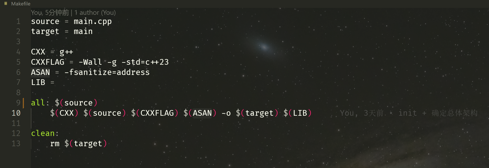
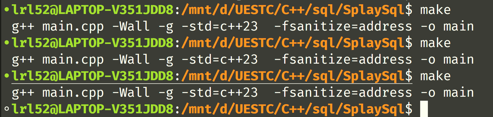
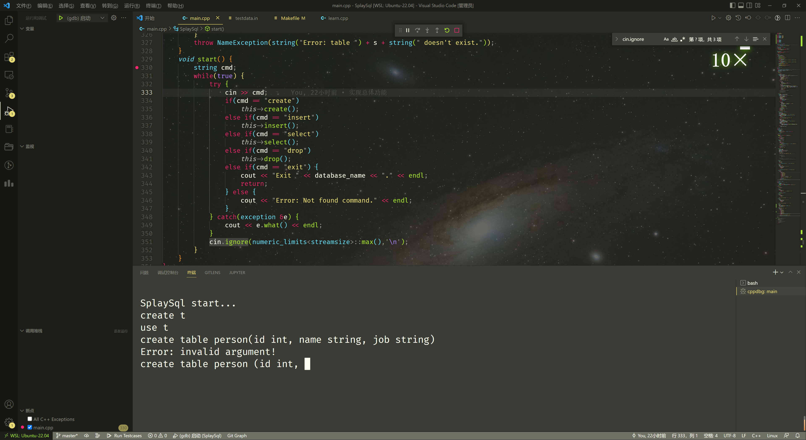
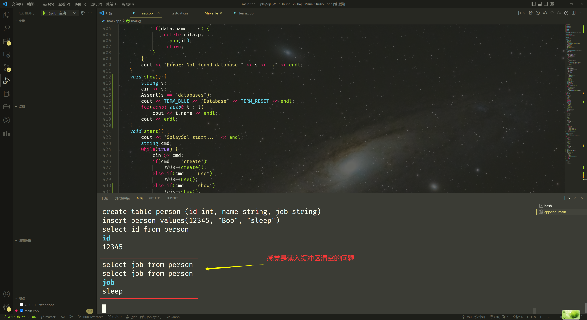
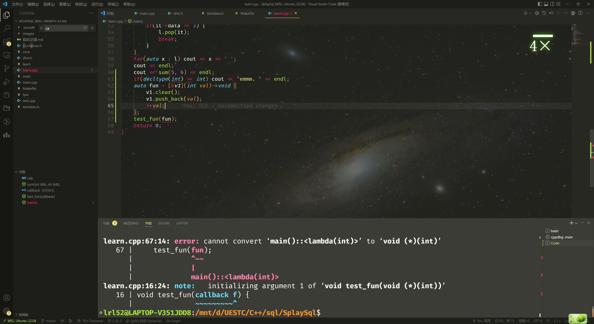
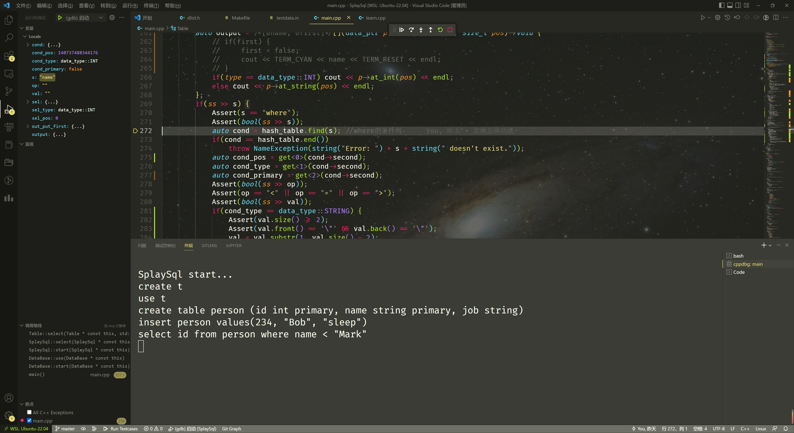
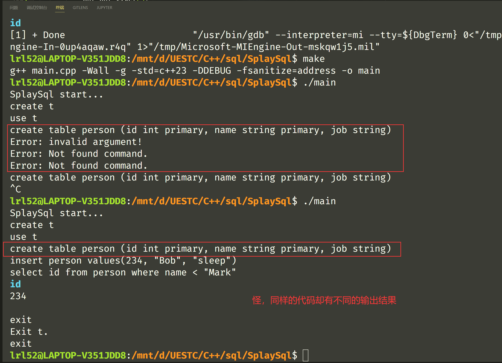
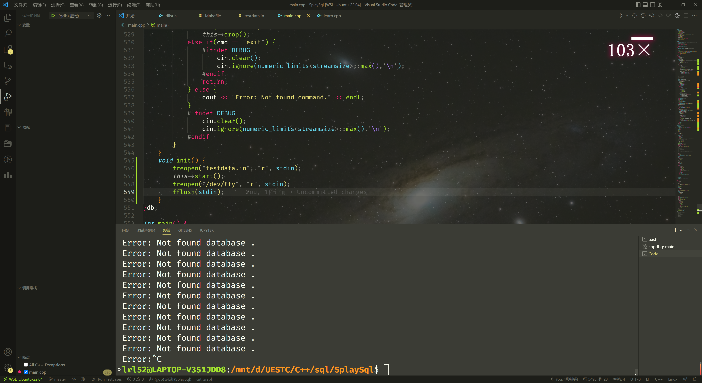
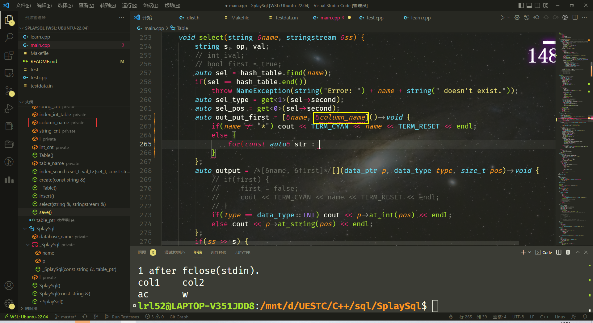
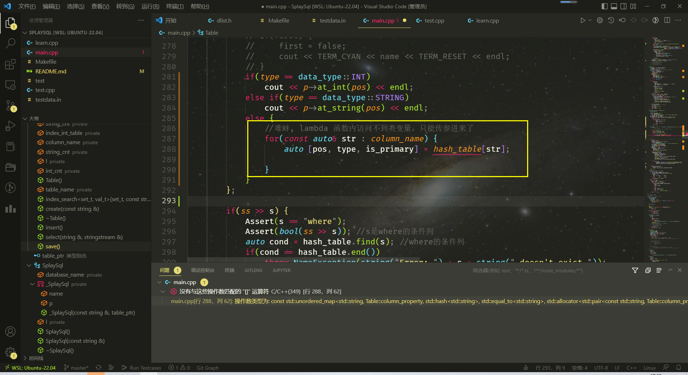

注意：使用dlist的type必须存在无参构造函数


**疑问**：为什么源文件没有更新，多次make都会重新编译？








**疑问**：C++ 读入缓冲区清空的问题，C 语言的 `fflush(stdin)` 没有效果，目前参照网上资料使用如下代码清空读入缓冲区（清空读入缓冲区是在输入参数错误的情况下调用，防止上次没有读完的错误输入影响下一次的操作）

```cpp
cin.clear();
cin.ignore(numeric_limits<streamsize>::max(),'\n');
```

但这样貌似可能会在输入数据正确的情况下，吞掉下一次的输入数据，**但在单步调试的时候却不会出现这种情况**




**疑问**：带捕获的lambda表达式不能作为回调函数？
已更改实现。




调试已经如此卡了。。






**疑问**：为什么重定向到伪终端后不阻塞了， 好像是文件数据没有读完才会阻塞？




lambda 函数不能捕获类变量？



为什么类型不正确呢？

（把传参的const去掉就行了）

