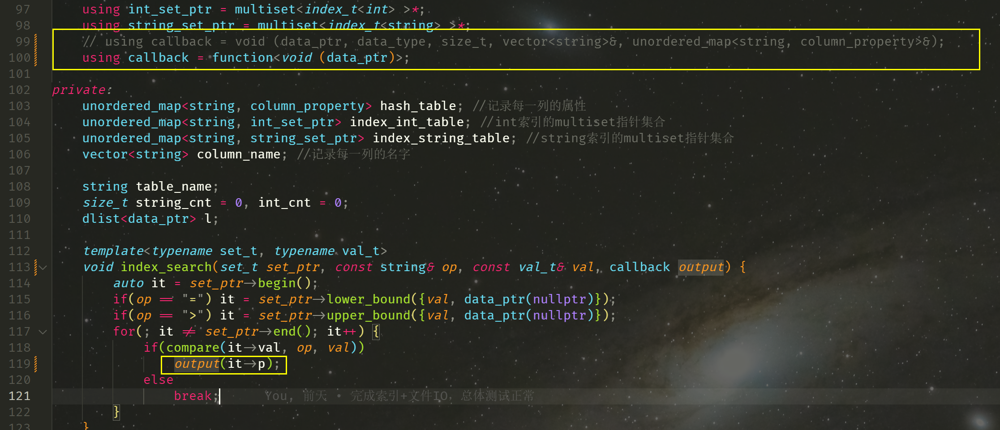

注意：使用dlist的type必须存在无参构造函数


**疑问**：为什么源文件没有更新，多次make都会重新编译？


貌似加上一个终极规则就行了？

```makefile
source = main.cpp
target = main

CXX = g++
CXXFLAG = -Wall -g -std=c++23 -DDEBUG
ASAN = -fsanitize=address
LIB =

all: $(target)

main: $(source)
	$(CXX) $(source) $(CXXFLAG) $(ASAN) -o $(target) $(LIB)

clean:
	rm $(target)
```


**疑问**：C++ 读入缓冲区清空的问题，C 语言的 `fflush(stdin)` 没有效果，目前参照网上资料使用如下代码清空读入缓冲区（清空读入缓冲区是在输入参数错误的情况下调用，防止上次没有读完的错误输入影响下一次的操作）

```cpp
cin.clear();
cin.ignore(numeric_limits<streamsize>::max(),'\n');
```

但这样貌似可能会在输入数据正确的情况下，吞掉下一次的输入数据，**但在单步调试的时候却不会出现这种情况**


**疑问**：带捕获的lambda表达式不能作为回调函数？


Solution：可调用对象作为回调，那么回调的类型最好是funtion模板，而不是直接的函数指针或函数类型。例如：

```cpp
 using callback = void (int); 改成：
 using callback = function<void (int)>; 
```

 这样，无论lambda有没有捕获都可以

高版本C++支持用[this]来捕获类成员

按照白老师给的建议目前已经能够支持带捕获的 lambda 表达式作为回调函数啦，顿时可以少传好多参数了




调试已经如此卡了。。


**疑问**：为什么重定向到伪终端后不阻塞了， 好像是文件数据没有读完才会阻塞？


lambda 函数不能捕获类变量？

已解决，使用 `[this]` 捕获类变量


为什么类型不正确呢？

（把传参的const去掉就行了）

